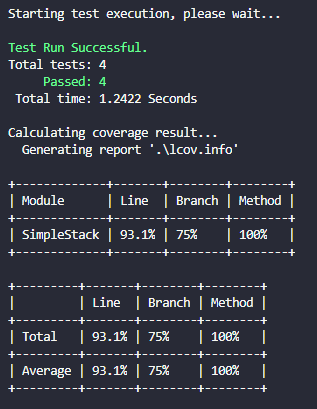
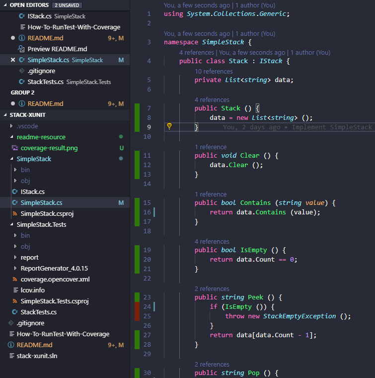
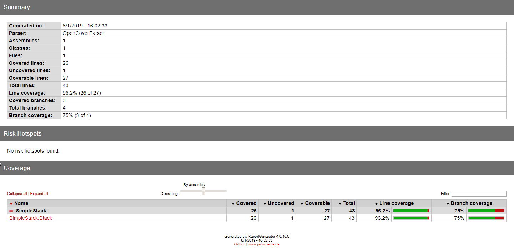
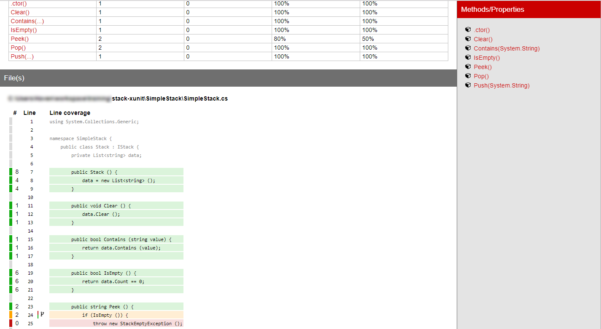

# Introduction

This project is a demo of combining some testing tools for C#/.NET Core:

- [xUnit](https://xunit.net/)

- [Coverlet](https://github.com/tonerdo/coverlet)

- [ReportGenerator](https://github.com/danielpalme/ReportGenerator)

The demo is about applying unit testing on a very simple Stack structure.

## Clone and run tests

```
git clone <the repo>

cd SimpleStack.Tests

dotnet test
```

## Run test with coverage

```
dotnet test /p:CollectCoverage=true /p:CoverletOutputFormat=lcov /p:CoverletOutput=./lcov.info
```



If you have installed [Coverage Gutters](https://marketplace.visualstudio.com/items?itemName=ryanluker.vscode-coverage-gutters) on your `Visual Studio Code`, you can see the coverage visualization.



## Run test to get opencover output

opencover is needed for ReportGenerator to generate coverage report. To get the opencover result, run:

```
dotnet test /p:CollectCoverage=true /p:CoverletOutputFormat=opencover
```

## Generate coverage report from opencover result

```
dotnet ReportGenerator_4.0.15\ReportGenerator.dll "-reports:coverage.opencover.xml" "-targetdir:coverage-report"
```

Go ahead to open `SimpleStack.Tests\coverage-report\index.htm` to see our awesome report.



